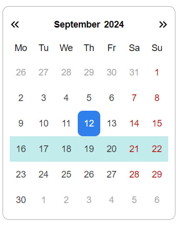
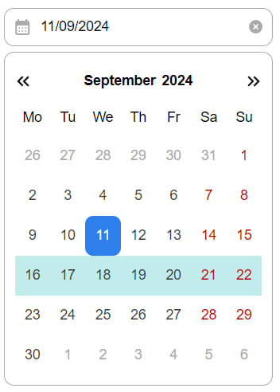
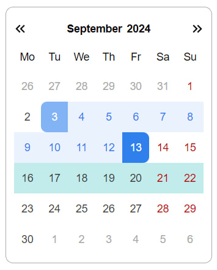
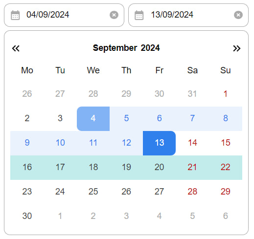
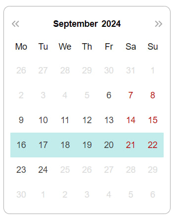
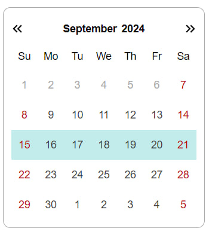
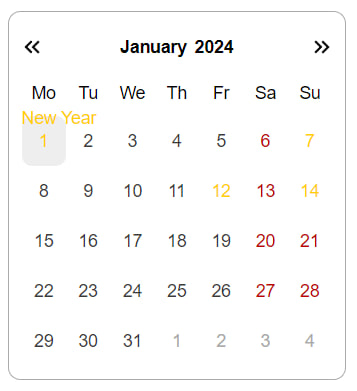

# Date Picker

Date Picker — это легковесная и интуитивно понятная библиотека, предназначенная для интеграции функционала календаря в ваши веб-приложения. Она поддерживает различные форматы отображения, позволяет настраивать минимальные и максимальные даты, добавлять задачи в конкретные дни, добавлять свои праздники и многое другое.

## Установка

    npm i date-picker-calendar-react

## Использование

```javascript
import { Calendar } from 'date-picker-calendar-react'

function App() {
    return <Calendar />
}

const root = createRoot(document.getElementById('root'))
root.render(<App />)
```

### Базовый календарь

```javascript
<Calendar />
```



При нажатии на год/месяц/неделю открывается дополнительный календарь с возможностью переключения по соответствующим параметрам

### Календарь с инпутом

```javascript
<Calendar isWithInput={true} />
```



Ввод даты осуществляется в формате дд/мм/гггг

### Календарь с выбором диапазона

```javascript
<Calendar isWithRange={true} />
```



### Календарь с инпутом и выбором диапазона

```javascript
<Calendar isWithInput={true} isWithRange={true} />
```



### Календарь с установкой минимальной и максимальной даты

```javascript
<Calendar isWithMinMaxDate={true} minDate="06/09/2024" maxDate="24/09/2024" />
```



Минимальная и максимальная дата вводиться в формате дд/мм/гггг, при неправильном вводе или при вводе минимальной даты больше максимальной ограничение применимо не будет.

### Календарь с началом недели с воскресения

```javascript
<Calendar isWithStartSunday={true} />
```



### Календарь с выделением праздников

```javascript
<Calendar
    isWithHoliday={true}
    holidaysData={[{ date: '12/01/2024', holiday: 'Some holiday' }]}
/>
```



Дата о празнике вводиться в формате дд/мм/гггг, в случае ввода некорректной даты, праздник отображаться не будет

### Получение данных

В приложении предусмотренно получение данных о пользовательском вводе

```javascript
import { calendarData } from 'date-picker-calendar-react'
```

Объект включает в себя данные о вводе в инпут, выбранном дне, выбранном диапазоне, активном годе, месяце и номере недели

## О приложении

### React

В качестве основной библиотеки использовался [React](https://react.dev/)

### Типизация

В приложении в качестве типизации использовался [Typescript](https://www.typescriptlang.org/)

Для типизации props используется interface.

### Стилизация

Стилизация с помощью styled-components [StyledComponents](https://styled-components.com/)

### Тестирование

Тестирование реализованно с использованием [Jest](https://jestjs.io/) и [RTL](https://testing-library.com/)

### Транспилер

Преобразование современного кода JavaScript в пердыдущие стандарты было осуществленно с помощью [Babel](https://babeljs.io/)

### Сборщик

В качестве сборщика проекта был [Vite](https://vitejs.dev/) и [Rollup](https://rollupjs.org/)

### Storybook

Для изоляционного построения пользовательского интерфейса использовался [Storybook](https://storybook.js.org/)

### Линтеры

Для анализа JS кода использовался [Eslint](https://eslint.org/), для его форматирования [Prettier](https://prettier.io/)

### Деплой

Деплой приложения находится на [Vercel](https://vercel.com)

## Зависимости

Node >= 18v

## Ссылки

Мой [gitHub](https://github.com/Kovallll)
